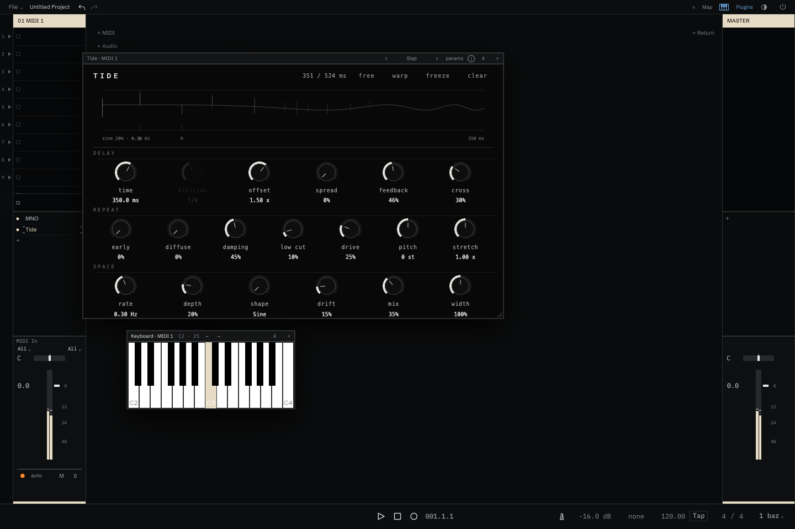

# Slide

A stereo delay inspired by [Slide Rules](https://sliderulemuseum.com/)! . The ui draws every
repeat on a log time axis; the controls are slide-rule rails and chips around
it. Ten presets. Builds as CLAP, AUv3, and WCLAP.



| Control | Effect |
| --- | --- |
| Left | Delay time of the left line, 1–2000 ms. |
| Right | Delay time of the right line, 1–2000 ms. |
| Link | How Right follows Left: Ratio, Difference, or Off. |
| Repeats | How many repeats sound, 1–64; past 64 is Hold, a unity loop with the filters open. |
| Shape | The decay envelope: Fade, through Flat, to Swell. |
| Blur | Sharp to Blur: diffusion plus a roof on the repeats. |
| Tone | Dark below centre, Thin above. |
| Mix | Dry/wet, equal power. |
| Mode | Stereo, Ping pong, Right is a tap, Left is a tap. |
| Medium | Tape, Oil can, Bucket, Tide, or Digital, with Wear for how much of its character; Wear 0 is clean on every medium. |
| Sync | Left and Right follow tempo divisions rather than milliseconds. |

Drag a rail handle to set its value; drag the tail marker in the picture to set
Repeats and Shape together. Hold Cmd or Ctrl to bypass snapping. The browser
prototype in `prototype/` is the behavioural spec; `docs/DESIGN.md` records the
vocabulary, the modules and their seams, and the decisions.

## Build

Requires CMake 3.24+, a C++17 compiler, and Ninja or Xcode. Dependencies are
pinned submodules under `external/`.

```sh
git clone --recurse-submodules https://github.com/charCulbert/Slide.git
cd Slide
cmake --preset native
cmake --build --preset native
ctest --preset native
```

For WCLAP, install WASI SDK 33.0 with pthread support:

```sh
export WASI_SDK_ROOT=/path/to/wasi-sdk
cmake --preset wclap
cmake --build --preset wclap
```

For macOS AUv3:

```sh
cmake --preset xcode
cmake --build --preset xcode --config Release
```

Outputs are written to `build-*/artifacts/`. The WCLAP archive is
`build-wclap/artifacts/Slide.wclap.tar.gz`.

## Credits

Built with these projects. Credit goes to their maintainers and contributors:

- [CLAP](https://github.com/free-audio/clap) and [clap-helpers](https://github.com/free-audio/clap-helpers) — the project maintainers and contributors.
- [clap-wrapper](https://github.com/free-audio/clap-wrapper) — the project maintainers and contributors; this project uses my fork.
- [CHOC](https://github.com/Tracktion/choc) — the project maintainers and contributors.
- [Compost](https://github.com/charCulbert/compost) and [char-clap-utils](https://github.com/charCulbert/char-clap-utils) — the project maintainers and contributors.
- [chardsp](https://github.com/charCulbert/chardsp) — which heavily leans on [Signalsmith DSP](https://github.com/Signalsmith-Audio/dsp) !
- [WASI SDK](https://github.com/WebAssembly/wasi-sdk), [LLVM](https://github.com/llvm/llvm-project), and [wasi-libc](https://github.com/WebAssembly/wasi-libc) — their maintainers and contributors, including the wider upstream projects they incorporate.

## License

ISC. See [LICENSE](LICENSE). Each WCLAP archive contains this license and
[third-party notices](THIRD_PARTY_NOTICES.md), with the full dependency license
texts in `THIRD_PARTY_LICENSES/`.
